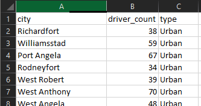
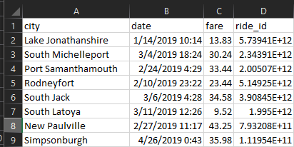
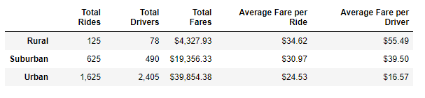
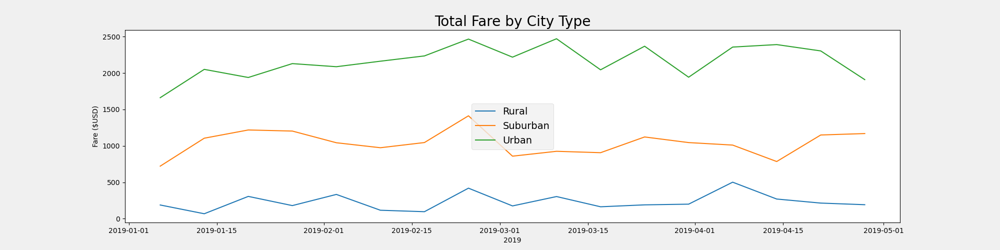

# module 5

## Project Overview
V. Isualize has tasked Omar and myself with analyzing some PyBer rideshare data to better understand performance. 

our data existing in two separate data sets that will be easier to analyze if we merge them. 

the comonality between the data sets is only the city, so we shall merge on this column
### expected steps
- Data Summary by city type (Urban, Suburban, Rural)
- use groupby methods and pivot
- Multi-line chart of total fares for each city type
- use matplotlib to create the line charts

## Challenges
one notable challenge for this project was the coutning of the drivers.
the driver count by city is listed in the ride data, and for each city on every entry it lists the full count of drivers for the city. doing a sum on this column results in multiple duplicates. to correctly refine this we need to trim down a dataframe to only a unique set of cities with corresponding type and driver count. once this is done we can then do a groupby and sum the driver count. 

## Data Summary Results
the below table of results has been formatted for readability and numeric type. 

we can see that Urban cities have far more total rides as well as drivers.
on average it is more expensive for a rider in the rural areas than urban areas. 
conversely it is more lucrative for drivers in rural areas likely due to the relative shortage compared to total riders. 

overall revenu remains relatively steady for all city types between January and May. 
Urban revenue is always the highest volume, followed by Suburban and then Rural far below. 

## Conclusion
Revnue remains highest in urban cities and lowest in rural areas. Revenue has not significnatly changed between January 2019 and May 2019. 
Drivers are likely to make more money on average (per driver) in rural areas. this may be useful to signal to drivers to help balance out supply and demand. having more drivers may also increase demand for ridership in the area, but that is purely speculation at this stage. 
