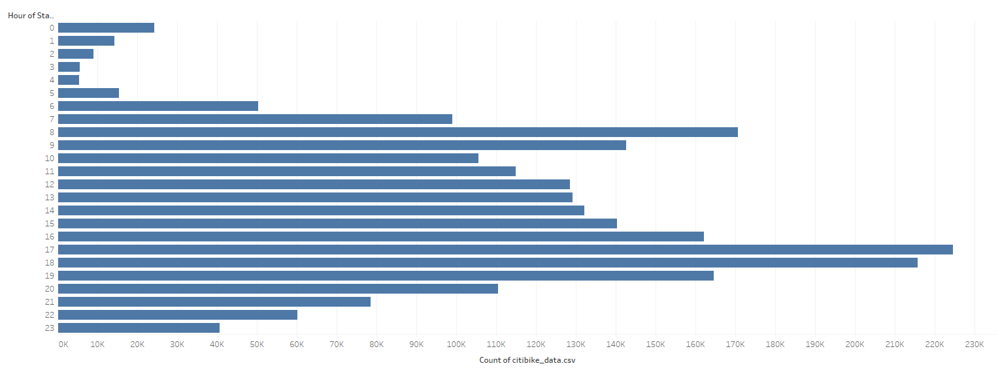
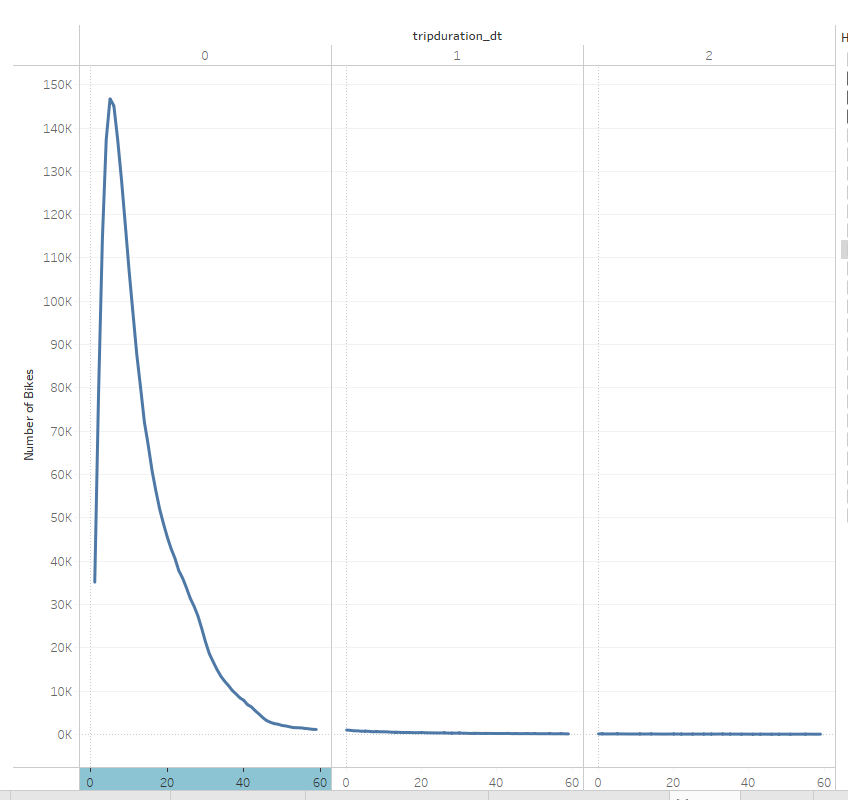
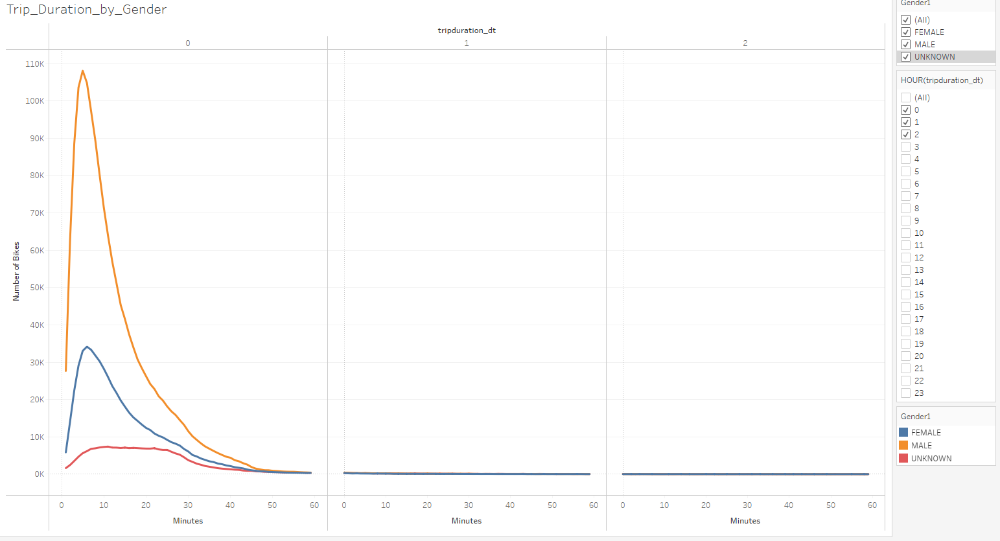
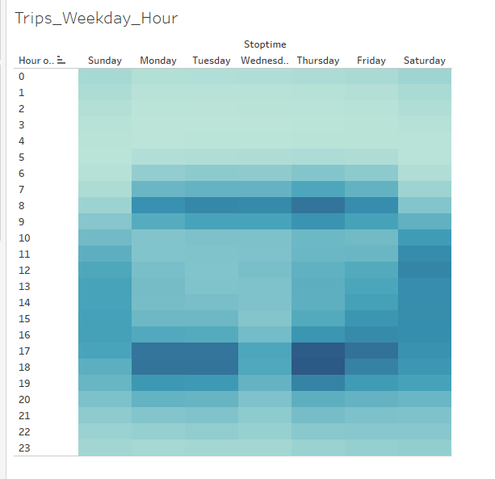
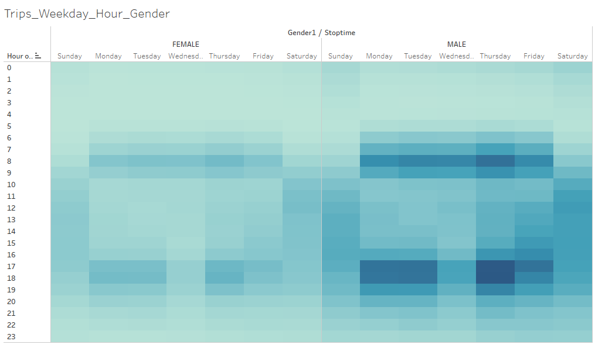
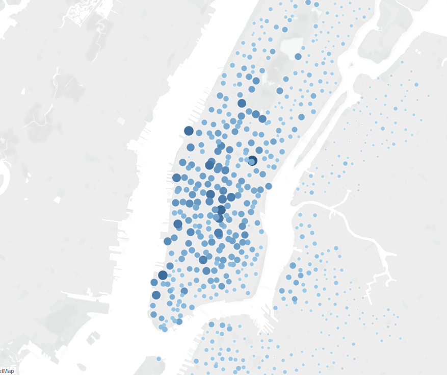
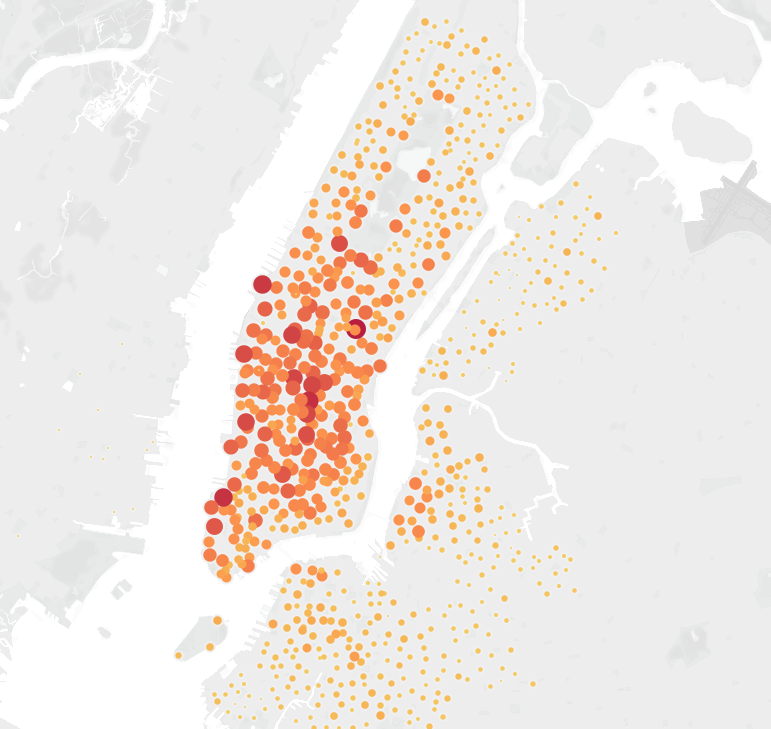

# Module 15

## Overview of Analysis
In this analysis we begin with data on citibike share in New York City. we seek to understand if this business model may be viable in Des Moines Iowa. We will leverage Tableu to visualize information to help informs this question. For the time being we are limiting data to a single month. 

## Results

Hereyou will find a link to the public story board with the results. 
[dashboard_link](https://public.tableau.com/app/profile/jameson.thornton/viz/UCB_Module_15_Challenge/Story1?publish=yes)

below are images of the results with brief explanations for your convenience:

This image shows the frequency of the starting trip times. this will be helpful to understand when there are busier times and slower times so that we can accomodate with the necesarry inventory. the busier times tend to be around morning and evening commute hours while the slowest times are from 2-5 in the morning. the ideal time to perform any maintenance would be during these early morning hours to ensure we have enough supply for the morning commute. 

this image shows the typical trip duration for a rider. the majority of riders are roughly between 10-20 minutes with a steep dropoff thereafter. this information may help us to understand the types of bikes we may need, and if we consider any eelectrification of the bikes how the charge times will need to last. 

this image shows the breakdown of trip duration by gender. we see a relatively similar ride time between men and women. notably we have more male riders. the red line is for unknown gender. 

 

this image shows the relative frequency of ridership scross hours of the day and days of the week. as noted previously we can see a higher usage rate on weekdays from 6-9am and again from 4-7pm during morning and evening commute hours respectively. on weekends we see a relatively steady usage rate from about 9am to 5 pm. 

this image is similar to the previous one but has a breakdown by gender. again we see a similar overall trend between men and women, but with notably more male riders. 

this image shows a breakdown of daily rider usage by user type and gender. notably more of our riders tend to be subscribed users, and again a significant portion of the customers are subscribed males. weekedays tend to see more ridership generally with an interesting lull on Wednesday and a peak on Thursday. 

this map shows the frequency of starting locations. the larger concentrations tend to be in downtown and mid town manhattan. 

this image shows the ending location frequency. again the larger concentrations tend to be in downtown and midtown manhattan. 

## Summary

overall the ridership tends to skew toward males that are subscribed customers who are riding weekdays during commute hours. if we wish to replicate this business model in Des Moines we may seek to establish a presence in a downtown business district where employees may wish to commute about. 

some additional insights that may be helpful:
1. find the average or typical starting and ending locations so that we can prepare our inventory to be available in those locations for the commute hours
2. breakdown the similar starting and ending location by gender, weekday, and subscribed customers to understand if there are notable different usage patterns. perhaps non-subscribed customers are tourists who are traveling to and from different tourist spots rather than work locations like our subscribed customers. 
