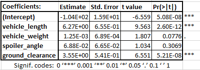
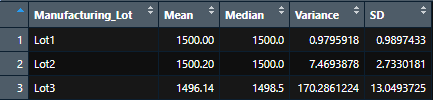
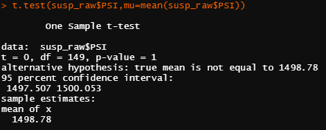
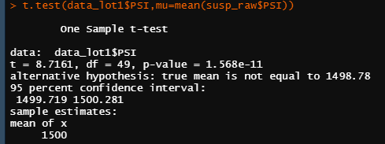
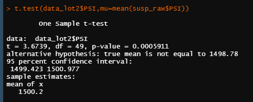
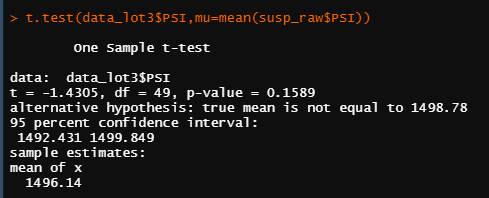

# Module 16

## Overview of Analysis
I will be analyzing a data set for a new "MechaCar" with 50 different prototypes. I will:
- Perform multiple linear regression analysis to identify which variables in the dataset predict the mpg of MechaCar prototypes.
- Collect summary statistics on the pounds per square inch (PSI) of the suspension coils from the manufacturing lots.
- Run t-tests to determine if the manufacturing lots are statistically different from the mean population.
- Design a statistical study to compare vehicle performance of the MechaCar vehicles against vehicles from other manufacturers. For each statistical analysis, I will write a summary interpretation of the findings.

## Results

### Part 1: Linear Regression to Predict MPG

Residual standard error: 8.774 on 44 degrees of freedom  
Multiple R-squared:  0.7149,	Adjusted R-squared:  0.6825  
F-statistic: 22.07 on 5 and 44 DF,  p-value: 5.35e-11 

these result suggest that *vehicle length* and *ground clearance* have the most significant impacts on mpg. 

we can conclude that the slope of our linear model is not zero because of the very small p-value obtained here (5.35e-11). 

the results suggest that the variables available can effectively predict the MPG of the prototype MechaCars.

### Part 2: Summary Statistics on Suspension Coils

Total summary  

Lot Summary  

if our required metric of variation for PSI is to be less than 100, in aggregate across all the lots we would pass this metric (variance is 62 PSI), but lot 3 fails this metric (variance is 170 PSI). Lot 3 has too much variation and should be reconsidered. 

### Part 3: T-Test on Suspension Coils

1 sample T-test  

1 sample T-test Lot1 population mean

1 sample T-test Lot2 population mean

1 sample T-test Lot3 population mean

for a single sample T-test comparing lots 1 and 2 to the population mean we so no statistically significant difference in the means (Lot1 P=1.5 e-11; Lot2 p=0.0006). 
however we do see a statistically significant difference in the means between lot3 and the population (p=0.1589)

again, this points to something peculiar happening with lot3 having significant variation of the mean PSI ratings. 

### Part 4: Study Design: MechaCar vs Competition
some of the main metrics I would want to consider for a consumer are the fuel efficiency and horsepower as a function of total vehicle cost. 
a lower cost for higher horsepower and higher fuel efficiency is desirable. 

to compare these we can get the pierson correlation coeficients for the relationship between the MechaCar cost vs. fuel efficiency and compare that to the competition cost vs fuel efficiency. in addition to the pierson coeeficient we will want to know what the slope relationship is. 
as stated above a lower cost for a higher fuel efficiency (if cost is the independant variable, then a smaller slope coeficient is better) and having a higher pierson correlation would help to validate this. 

we can also use a 2 sampel t-test to see if there is a statistically significant difference in the average values of fuel efficiency and horsepower of the two fleets. if they are statisitically significant then we may be able to use this information to support claims that the MechaCar has better performance. 
if they are not statistically different we can use that to help refute a competitor claim that their fleet is better (the null hypothesis is likely true and the cars are roughly the same or no different). 
we would need similar data for both manufacturers, and we would want it on a large quantity of samples (either individual units or a large number of models). we would likely want at least 100, and may not need more than 1000 to have a strong claim. 

