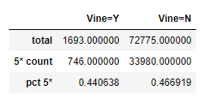
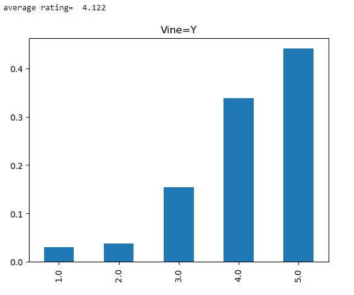

# Module 17 - Amazon product review analysis

## Overview of Analysis
in this project we will will leverage spark on google collab to prepare analysis for a large group of amazon reviews.
I chose to analyze these reviews which can be found here:  
https://s3.amazonaws.com/amazon-reviews-pds/tsv/amazon_reviews_us_PC_v1_00.tsv.gz

This data is broken down into a handful of table and then submitted to our AWS RDS. this was created with some simple SQL to create the tables in PGAdmin which we connected to our AWS RDS. 

### tables
the tables [with columns] are as follows:
- customers_table
  - customer_id
  - customer count
- products_table
  - product_id
  - product_title
- review_id_table
  - review_id
  - customer_id
  - product_id
  - product_parent
  - review_date
- vine_table
  - review_id
  - star_rating
  - helpful_votes
  - total_votes
  - vine
  - verfied_purchase

from PGAdmin we exported a csv of the vine_table data for further analysis. 

## Vine Analysis
The primary questions we seek to answer are:
- How many Vine reviews and non-Vine reviews were there?
    - Vine=Y - 1693
    - Vine=N - 72775
- How many Vine reviews were 5 stars? How many non-Vine reviews were 5 stars?
    - Vine=Y - 746
    - Vine=N - 33980
- What percentage of Vine reviews were 5 stars? What percentage of non-Vine reviews were 5 stars?
    - Vine=Y - 44.1%
    - Vine=N - 46.7%

the results are summarized simply in the table below:  

based on the percentage of 5* reviews there does not appear to be any bias. 

# However!
if we look at ratings other than 5* (and normalize on total reviews) and also take into account the average * rating we can see below that there may in fact be some bias. there is a significant difference in the amount of 1* reviews from Vine=Y (Paid) and Vine=N (Unpaid). 
so it seems that the program does make some difference, just not in the 5* reviews. 

Just like you cannot rely only on the averages of large data, we also need to consider the spread of the data in other ways, and visualizations help a lot here. 