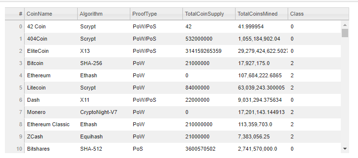
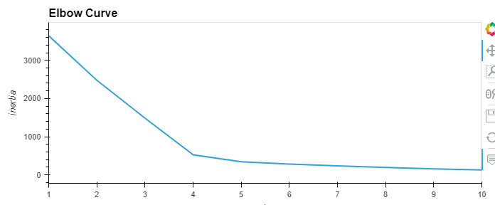
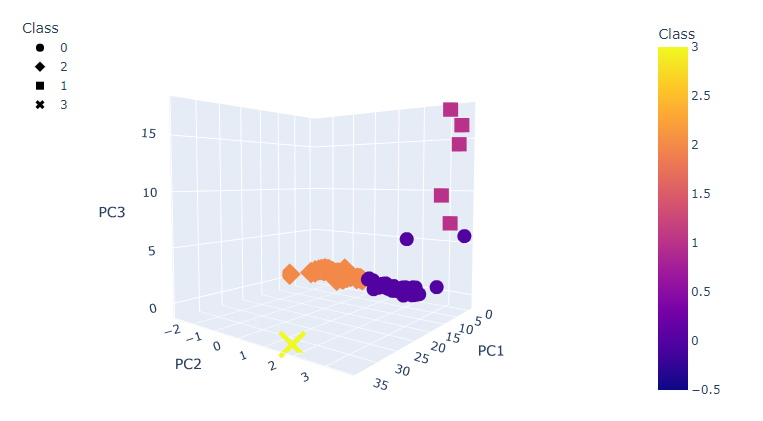
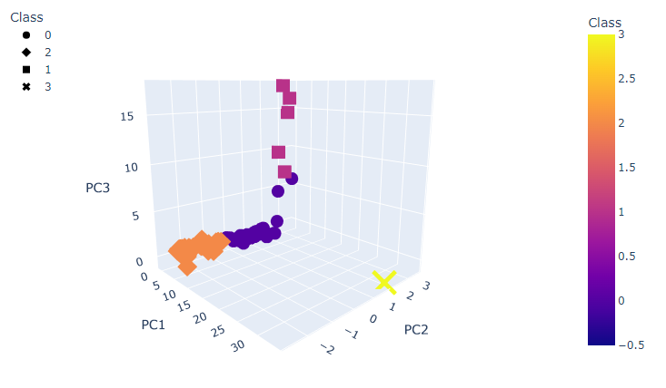
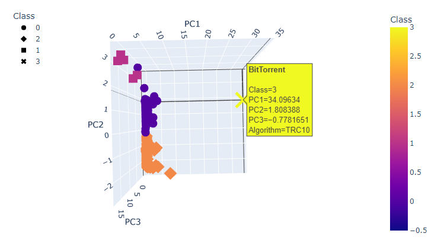
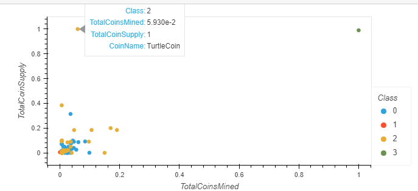

# Module 19 - Unsupervised Machine Learning with Crypto Currencies 
## Overview of Analysis
given a list of several hundred crypto currencies we seek to use unsupervised machine learning K-clustering algorithm to group various coins together. 
we determine the preferred number of clusters using the inertia and range of K values. we provide visulization of the cluster groups. 

## Results

here is our partially cleaned up table of the currencies to analysze (only contains data with all columns populated, that are tradeable, and have some mining ocurring)

we determined that 4 clusters would be optimal

we added 3 principal component columns to aid in our clustering analysis. 

and we see our clusters forming rather nicely. 

we also provide a visual of normalize coin supply vs. coins mined:

## Summary
overall unsupervised learning is a great tool when we dont know how we want to classify or group our data but we believe that such a classification may be useful for us to simplify our understanding or to help us make decisions. 
these clusters may help us to diversify our portfolio of crypto currencies by trying to invest in a few from each group where feasible. 