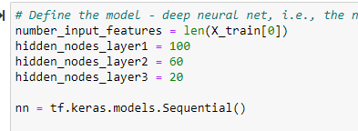

# Module 20 - Neural Networks

we seek to build a neural network to help "Alphabet Soup" determine which grant applicants are most likely to be successful with their grants in doing good. 

## Results

### Data Preprocessing

- What variable(s) are considered the target(s) for your model?
   - The target variable is "IS_SUCCESSFUL"
- What variable(s) are considered to be the features for your model?
   - The Features are:
     - Application Type
     - Affiliation
     - Classification
     - Use Case
     - Income Amount
     - Special Consideration
     - Ask Amount
- What variable(s) are neither targets nor features, and should be removed from the input data?
   - the "EIN" and "NAME" variables are unneeded and can be removed. 

### Compiling, Training, and Evaluating the Model

- How many neurons, layers, and activation functions did you select for your neural network model, and why?
   - 2 layers, 80 and 30 neurons respectively

    

- Were you able to achieve the target model performance?
   - I was unable to achieve the 75% target accuracy. 73% was the best I achieved. 
   
- What steps did you take to try and increase model performance?
   - Increase neurons and layers -> 3 layers total, 100, 60, 20 neurons respectively
   
   - remove noise data outliers: remove the top 10% of AMT_REQUESTED (some amounts were in excess of $1 Billion)
   - remove columns that may not contain useful information: "APPLICATION TYPE" & "CLASSIFICATION" [rather than bucket some to OTHER]

## Summary
Neural Networks are challenging. There are many adjustable parameters that are up to the analyst. With so many levers to pull it can be very difficult to determine an optimal outcome or to achieve the goal accuracy. 

further analysis could look at the sensitivity of the individual parameters to determine if some should be removed or prioritized. 