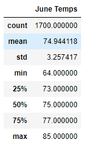
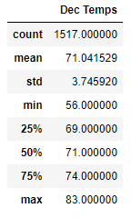
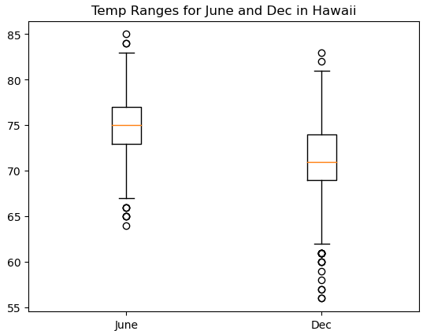

# Module 9 - Advanced Data Storage and Retrieval (Surf's Up)

## Project Overview
using SQLite, SQLAlchemy, and Flask gather weather data for Hawaii to investigate the feasibility of a surf and ice cream shop to invest in with W. Avy. we want to understand the weather patterns to determine if such a business may be viable for a large part of the year.

### Expected steps
- extract data from an existing sqlite file 'hawaii.sqlite' 
- use SQLAlchemy to perform query-like functions
- filter data for desired time frames (June days, and December days)
- display summary statistics

#### Deliverables
1. June data summary statistics

2. December data summary statistics

but graphical displays can be more readily digestible than tables, so a boc plot may be valuable:

## Challenges
understanding what data is in the session result (e.g. columns) is not as intuitive as pandas. 
I also had some challenges in approaching gathering data for a given month for all years. I resolved on simply listing out ranges for each month across the 8 years of data, but this is not scalable: I wonder if there is a better way using the SQL style queries (in pandas it would be much easier).

## Conclusion
we can leverage python and SQLAlchemy to interface with SQLite (and presumably a SQL database) to leverage the power of python and pandas to do additional analysis without having to switch between applications. 
