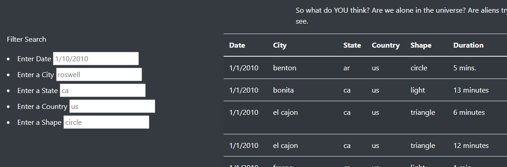
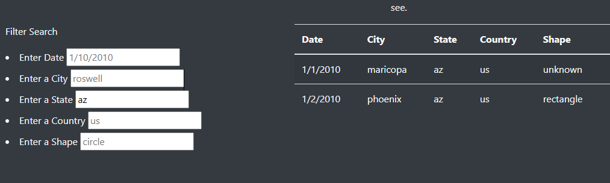
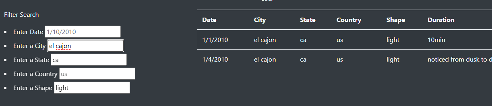

# Module 12 UFO-MyGoodness JavaScript is Alien
## Project Overview
"Dana" has asked us for help making a dynamic webpage for UFO sightings. we will use HTML and JavaScript to create this. we will have some static images and text, but will also have a dynamic aspect to the page containing data that can be filtered by user input. 

## Results
we have successfully implemented the HTML webpage as desired by Dana. we have ingested the data set of UFO sightings. the default view upon loading the page shows all data results (unfiltered)

### Default

there are example filter text to help the user understand what types of things they may want to filter by. 

### Single Filter (State)

this demonstrates that after entering a state abbreviation (az) into the state text field and then clicking away into another field the data is automatically updated to show only results containing the chosen state (Arizona)

### Multiple Filters

this demonstrates that multiple filters can be entered to further narrow down the search. the algorithm imlicitly assumes an AND type of search feature based on the criteria. this may result in an empty table if the two filters do not contain an interesction of data. 

## Summary
### Drawback
One fairly clear drawback is that the user may easily enter data that does not exist within the data set resulting in an empty return. this can also happen due to typos or mis-use of capital letters. 

### Improvements
1. we could attempt to at least improve the handling of capital and lower case letters by forcing the input to all lower (or upper) in the back end and compare to the data set as forced to all lower (or upper). 

2. another area to improve would be to potentially allow a toggle of AND style inclusive filter as well as an OR style any match filter. 

3. finally having a range of dates would likely greatly assist with usability as a user may not know the exact date of the event they are looking for. 
