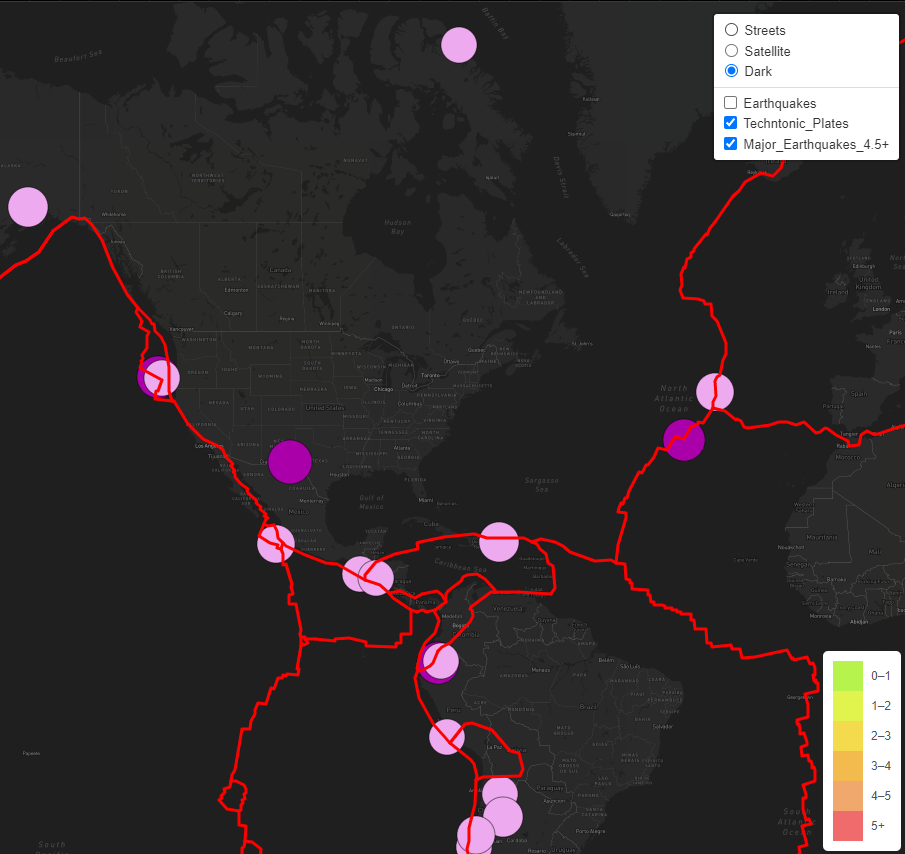

# Module 14 GeoJSON with Javascript

## overview
in this module we learned how to work with GeoJSON files and leaflet to create useful interactive maps based on real world data with calls to json files on public websites. 
we learned about different types of map features like points, lines, polygons and collections of these items. 

## deliverables
1. techtonic plate data
2. major earthquakes data
3. additional map layer

## Results
the final product looks like this:

## Summary
leveraging existing public data, geographic information, and being able to display it all in a dynamic html file will be very useful in sharing data that is accessible to a general audience. 