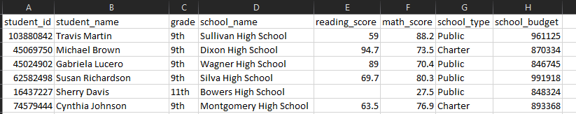

# Student Data Analysis

## Project Overview
Maria seeks analysis on an updated data set of student information. the data includes the following in a csv:
- Student ID
- Student Name
- Grade
- School Name
- Reading Score
- Math Score
- School Type
- School Budget

the results should deliver information....

## Data Summary Results

## Conclusion
