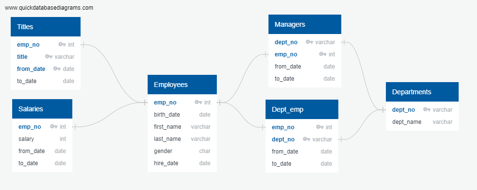
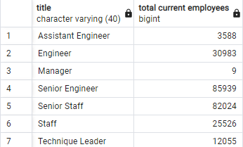
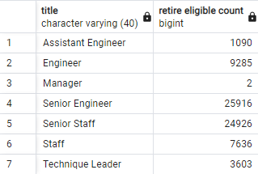
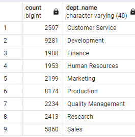
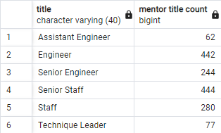
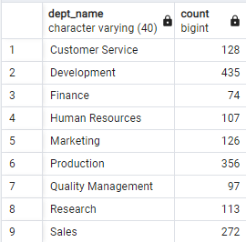

# Module 7 - SQL for "Pewlett-Hackard"

## Project Overview

"Pewlett-Hackard" is seeking to convert their set of roughly 6 csv files containing employee info into a more advanced relational database. 
additionally they seek to understand how many employees are eligible for retirement such that they may prepare to backfill for those roles and which employees may be suitable for mentors. 

the CSV files are:
- employees (~300k records)
- salaries (~300k records)
- titles (~440k records)
- departments (9 records)
- dept_manager (~25 records)
- dept_emp (~330k records)

### Expected steps
1. develop an ERD for existing set of csv files
2. create schema, import csv files
3. JOIN needed tables to get relevant data (birth date, title, emp_no, dept)
    - INSERT results into a new table, export table to new CSV
    - Filter table (DISTINCT) to provide only one result per employee, result only current employees ('to_date'=9999-01-01)
    - INSERT results into a new table, export table to new CSV
5. provide list of mentorship eligible employees (born 1965)
    - filter on current, and distinct by emp_no
    - INSERT results into a new table, export table to new CSV

#### Deliverables
- Number of Retiring Employees by Title
- Employees Eligible for Mentorship Program

## Challenges

## Data Summary Results
Enhanced Relationship Diagram is below:

1. Total Current Employees: over 200k

2. Retirement eligible employees based on title and department: about 70k

3. mentor eligible employees based on title and department: about 1550

4. new hires will outnumber mentors by 40 to one. not accounting for the variation of titles, each eligible mentor would need to act as a teacher with 40 students in a lecture hall. this is not sustainable. 

## Conclusion
a significant amount of the existing workforce will need to be replaced by new hires; roughly 70k or about 30%. 
if we assume a limited age range (of a single year!) to be mentors, then we will be severly short handed on mentors. we should expand the range of eligble mentors. developing a graph by age range would be helpful to determine the range of eligibility. this could be accomplished in excel or python with the useful graphic tools. 
