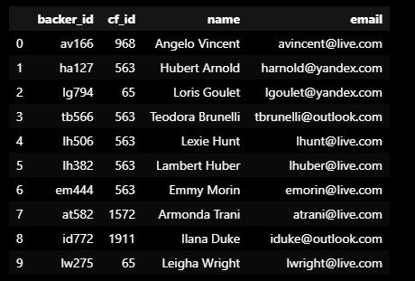
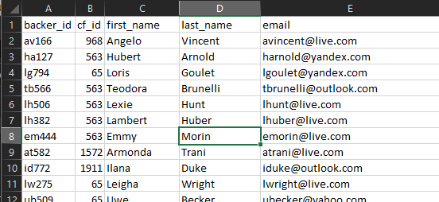
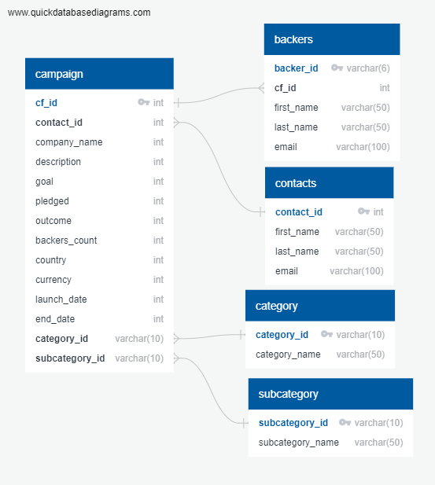
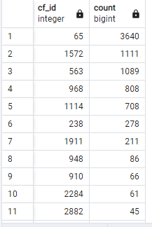

# Module 8 - Extract, Trasnfer, Load for "Independant Funding"

## Project Overview
Use Python, Pandas, and Jupyter notebooks to do the extract and transform phases. Specifically, I will extract and transform the backers’ contact information from a CSV file to create a DataFrame that will be exported as a CSV file. I'll then do the load phase. Specifically, I’ll use the dataset to create an ERD and a table schema for creating a new table in the crowdfunding_db database. And, I’ll upload the CSV file that contains the backers’ information into this table. Finally, I’ll perform a data analysis on the crowdfunding_db database by using SQL queries.

### Expected steps
- extract data 'backer' data from csv
- digest data using regular expressions (regex) to break into data columns
- create entity relationship diagram (ERD), build tabel schema, and load data into SQL database
- (Optional) SQL analysis

#### Deliverables

Deliverable 1: Extract Data

Deliverable 2: Transform and Clean Data

Deliverable 3: Create an ERD and Table Schema, and Load Data

Deliverable 4: SQL Analysis

## Challenges
initially forgot to export the backers table without an index. initially read into SQL with an error. corrected it and reloaded. 

## Conclusion
data was successfully extracted from a csv, transformed using pandas in python, and loaded into a SQL database. 
